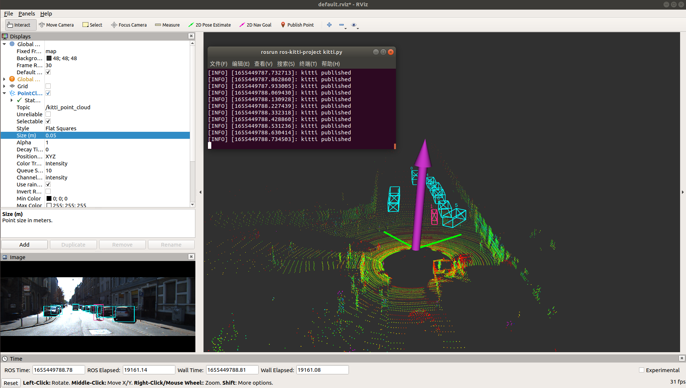

## ROS1(melodic) + python2.7 + Pycharm

### 1.Install ROS and miniconda3

### 2.Create conda virtual environment

`conda create -n ros1_py27 python=2.7`

### 3.Create ROS work_space

```bash
mkdir ~/catkin_ws && cd catkin_ws
mkdir src && cd src
git clone https://github.com/daxiongpro/ros-kitti-project.git  # catkin_create_pkg ros-kitti-project
cd ../../   # catkin_ws
catkin_init_workspace
catkin_make
```

### 4.Make pycharm configration

* [Add ros dist-package in your environment](https://blog.csdn.net/weixin_38405166/article/details/114808500).
* Set up Environment Variable in Pycharm[libcv_bridge.so](https://blog.csdn.net/qq_42800654/article/details/123553599),[tf2_ros](https://blog.csdn.net/weixin_44445507/article/details/118335039), it is for the same purpose of `source devel/setup.zsh` in Pycharm.

### 5.Prepare kitti dataset

* Download kitti raw dataset `2011_09_26_calib.zip` and `2011_09_26_drive_0005_sync.zip`,`label_02`.[Download in baidu netdisk](https://pan.baidu.com/s/1DZwj3My0M6UGnc-JIU5cRw?pwd=k1f5), password:`k1f5`
* Generate dataset directory as follows:

```bash
kitti_raw_data
kitti
├── bag
│   ├── 2020-07-04-15-31-16.bag
│   ├── kitti_2011_09_26_drive_0005_synced.bag
│   ├── kitti2bag.py
│   └── readme.txt
├── RawData
│   └── 2011_09_26
│       ├── 2011_09_26_drive_0005_sync
│       │   ├── image_00
│       │   ├── image_01
│       │   ├── image_02
│       │   ├── image_03
│       │   ├── oxts
│       │   └── velodyne_points
│       ├── calib_cam_to_cam.txt
│       ├── calib_imu_to_velo.txt
│       └── calib_velo_to_cam.txt
└── training
    └── label_02
        ├── 0000.txt
        ├── 0001.txt
        ├── 0002.txt
        ├── 0003.txt
        ├── 0004.txt
        ├── 0005.txt
        ├── 0006.txt
        ├── 0007.txt
        ├── 0008.txt
        ├── 0009.txt
        ├── 0010.txt
        ├── 0011.txt
        ├── 0012.txt
        ├── 0013.txt
        ├── 0014.txt
        ├── 0015.txt
        ├── 0016.txt
        ├── 0017.txt
        ├── 0018.txt
        ├── 0019.txt
        └── 0020.txt
```

### 6.Run python script

* Change the dataset path in python script
* Run python:
  eg1:`python kitti.py`(in ros-kitti-project/src)
  eg2:run `ros-kitti-project/src/kitti.py` in Pycharm

### 7.RVIZ visualization

* Run rviz

```bash
roscore
rviz
```

* Add Pointcloud topic

---

### Now, you can see the image, pointcloud, 2D BBox, 3D BBox, IMU data published!


